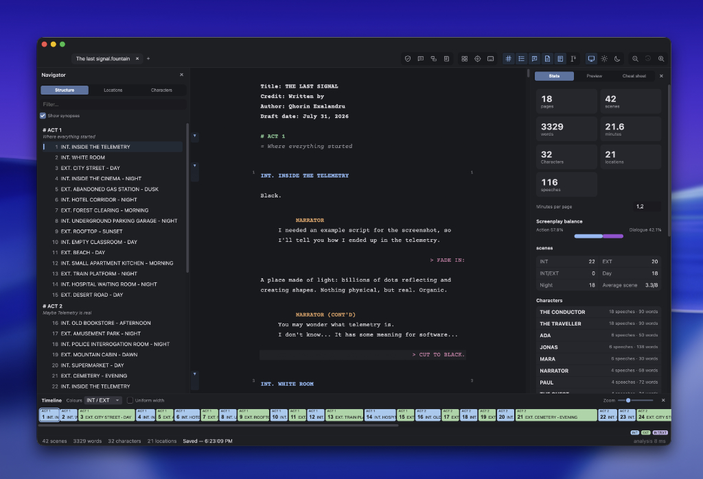
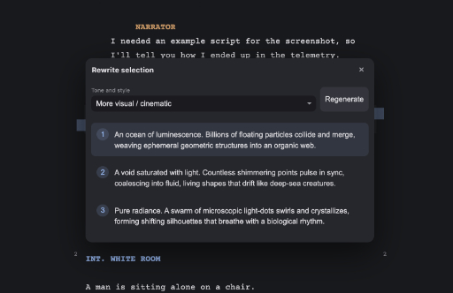

# Fountain Studio

The all-in-one application for screenwriting.



## What is Fountain Studio?

Fountain Studio is a screenwriting app built on the Fountain format. It carries a screenplay all
the way from first draft to production pages.

Your screenplay stays a plain-text `.fountain` file you can open in any editor. Everything the
application adds — layout, versions, the bible, revision state — lives in companion files beside
it, so nothing is locked inside a proprietary document.

## Features

- Fully compatible with the Fountain format
- Automatic formatting and a live preview
- Navigation by scene, location and character
- Corkboard, with drag-and-drop reordering
- Timeline view with scene type options
- Narrative bible
- Snapshots, with a scene-by-scene comparison
- Production revisions: locked scene and page numbers, revision marks, coloured pages
- PDF export
- Statistics
- English and French interface
- And more...

## Helpers and AI Features



Fountain Studio ships with AI features meant to help you write faster, not to write for you.

- Synonym search
- Reformulation
- Coherence analysis
- Character voice consistency
- Narrative repetition detection
- Character name suggestions
- And more...

No key and no model are bundled: you point the application at your own provider — OpenAI,
Anthropic, Google, Mistral, or a local Ollama. Your key is encrypted through the operating
system's keychain, and on a machine that offers no keychain it is held for the session only
rather than written to disk in the clear.

Nothing else reaches the network. There is no updater, no telemetry and no account: every
feature other than these ones works offline.

## Development

Requires Node 22 or newer.

```sh
npm ci
npm run dev            # run the application in development
npm test               # unit tests (Vitest)
npm run build          # compile into out/
npm run test:e2e       # end-to-end tests (Playwright, needs a build first)
```

The verification gates, in the order continuous integration runs them:
`npm run check:licenses`, `npm run format:check`, `npm run lint`, `npm run typecheck`,
`npm test`, `npm run build`, then `npm run test:e2e`.

## Licence

Fountain Studio — desktop screenwriting application for the Fountain format.
Copyright (C) 2026 Corin Alexandru

This program is free software: you can redistribute it and/or modify it under the terms of the
GNU Affero General Public License as published by the Free Software Foundation, either version 3
of the License, or (at your option) any later version.

This program is distributed in the hope that it will be useful, but **without any warranty**;
without even the implied warranty of merchantability or fitness for a particular purpose. See the
GNU Affero General Public License for more details.

You should have received a copy of the GNU Affero General Public License along with this program.
The full text is in [LICENSE](LICENSE); if not, see <https://www.gnu.org/licenses/>.

### Third-party libraries

Every dependency of Fountain Studio is under a permissive licence — a project rule, checked on
each build by `npm run check:licenses`, which regenerates
[THIRD-PARTY-NOTICES.md](THIRD-PARTY-NOTICES.md). The Courier Prime typeface is distributed under
the SIL Open Font License 1.1, whose text accompanies the font files in
[resources/fonts/OFL.txt](resources/fonts/OFL.txt).
